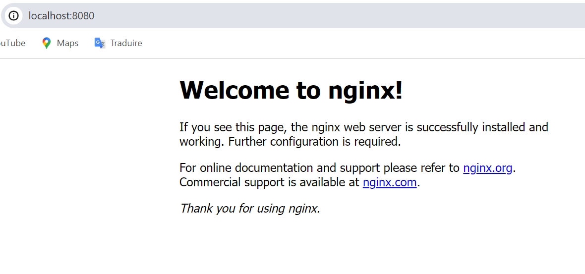
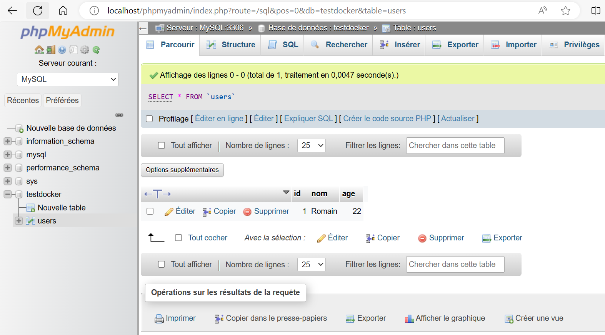
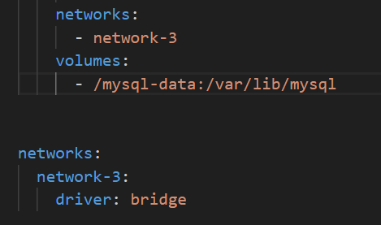

# Docker

## Part 1: Concepts conteneur

### 1. Concepts conteneur

- Avantages de la conteneurisation :

**Portabilité** ça permet de pouvoir s'executer sous n'importe quel plateforme ou cloud 

**Efficacité** les conteneurs sont plus légers car ils partagent le noyau du système d'exploitation de la machine hôte pour chaque applications ce qui réduit les temps de démarrage 

**Isolation** ça permet de faire fonctionner l'application de façon indépendente. Ainsi quand un conteneur cesse de fonctionner, cela n'affecte pas toute l'application

**scalabilité** ça permet l'ajout de nouvelles fonctions, mises à jour et caractéristiques instantanément sans que cela affecte les applications d'origine

- Schéma comparatif entre une VM et un conteneur :
 

La conteneurisation permet à chaque application d'utiliser le même système d'exploitation alors que les VM ont une isolation complète car elle ont chacunes leur propre système d'exploitation. Les conteneurs sont beaucoup plus légers que les VM car ils partagent le même noyau de l'hôte, cela améliore l'efficacité des serveurs et donc réduit le temps de démarrage et les coûts liés aux serveurs et aux licences.

### 3. Commandes de base

- Différentes commandes Docker :

**docker build** : créer une nouvelle image  
**docker run** : executer un conteneur  
**docker ps** : affiche les conteneurs en cours d'exécution  
**docker stop** : arrête un conteneur en cours d'exécution  
**docker start** : démarre un conteneur  
**docker rm** : supprime un conteneur arrêté   
**docker images** : liste les images  
**docker push** : pousser une image  
**docker pull** : télécharger une image   
**docker rmi** : supprime une image  

- Lancer votre premier conteneur
  
J'ai utilisé les commandes suivantes :  
docker pull nginx:latest  
docker images  
docker run -p 8080:80 nginx:latest  
docker stop (id)  

### 4.Volumes Docker

Est ce que vos données sont encore présentes ? Non elles ne sont plus présente

- base de données qui tourne sur le port 3306 :  
 

- principe de volume Docker :  
Un volume permet de lier un dossier de la machine hôte et un dossier où MariaDB stocke ses données, ce qui permet aux données de la base de données d'être stockées dans le dossier de la machine hôte et donc de ne pas être supprimé même si le conteneur est supprimé

- Quelle est la différence entre une application statefull et stateless ?  
Une application statefull conserve l'état actuel de l'application et garde en mémoire les interaction précédentes alors qu'une application stateless ne conserve pas l'état actuel

### 5.Réseaux Docker

- les différents mode de réseau :  
**Bridge** : réseau par défaut, permet de connecter des conteneurs entre eux  
**None** : le connecteur à acune adresse IP, c'est utilisé pour les connecteurs n’ayant pas besoin d’accès réseau  
**Host** : le conteneur prend le même réseau que celui de l'hôte  
**Overlay** : permet de connecter des conteneurs sur différentes machines hôtes  
**Macvlan** :  permet d'attribuer à un conteneur une adresse physique

- Liste des réseaux docker :  
J'utilise la commande suivante **docker network ls**  
Les réseaux docker sur ma machine sont **bridge**, **host** et **none**

- A quel réseau appartient ce conteneur? :
J'utilise la commande suivante **docker inspect (id)**  Le conteneur appartient au réseau bridge

### 6.Exercice Pratique
Voici mon fichier docker-compode.yml :  
   
 

Documentation décrivant votre processus :  
J'ai commencer par définir le réseau, le volume et les variables d'environnement de l'image mysql. Puis j'ai fais la même chose pour l'image de ghost en défissant également le port et en disant quelle dépend de l'image mysql pour définir l'ordre de démarrage.

Blog Ghost fonctionnel :  
 

## Partie 2 : Approfondissement des Connaissances

## 1.Écrire son Image Docker
**Dockerfile** : https://github.com/charcochoco/dockerfile.git

## 2.Optimisation de l’image Docker  
L'image créé à une taille de 43,24MB https://github.com/charcochoco/dockerfile.git

## 3.Stack Multi-Service avec Docker  
Comment configurez-vous les variables d’environnement?  
WORDPRESS_DB_HOST: mariadb
WORDPRESS_DB_USER: wordpress
WORDPRESS_DB_PASSWORD: password
WORDPRESS_DB_NAME: wordpress  

MYSQL_ROOT_PASSWORD: root
MYSQL_DATABASE: wordpress
MYSQL_USER: wordpress
MYSQL_PASSWORD: password

Comment l’application wordpress communique-t-elle avec le conteneur
MariaDB ?  
L'application communique avec le conteneur MariaDB car ils sont sur le même réseau 

## 4.Comprendre la Docker Registry
- Interet registry interne dans une entreprise :  
L'interet pour une entreprise est de centraliser toute ces images au même endroit, d'augmenter la sécurité. Cela permet aussi de faire des déploiements et les mises à jour plus rapidement.

- Exercice Pratique :  
docker login  
docker build -t charcochoco/devops-training:1 .  
docker push charcochoco/devops-training:1  
https://hub.docker.com/repository/docker/charcochoco/devops-training/general (docker push charcochoco/devops-training:1)

## 5.Exercice Pratique
Lien vers l'image Docker sur Docker Hub :   
Api : https://hub.docker.com/repository/docker/charcochoco/api/general  
Backoffice : https://hub.docker.com/repository/docker/charcochoco/backoffice/general 

Lien vers le dépôt GitHub :  
https://github.com/charcochoco/dockerfile.git

# Partie 3 : Orchestration de Conteneurs

## 1.Cluster de conteneurs et Orchestration

Clusterisation des conteneurs :  
L'orchestration des conteneurs permet d'automatiser le déploiement, la gestion, la mise à l'échelle et la mise en réseau des conteneurs. Cette technologie permet de déployer la même application dans différents environnements sans modifier sa conception. Les outils les plus connues sont Kubernetes, Docker Swarm et Apache Mesos.

Concept de microservice :  
Les microservices sont une méthode développement logiciel utilisée pour concevoir une application comme un ensemble de services modulaires. Chaque module répond à un objectif métier spécifique et communique avec les autres modules

Scalability :  
C'est la capacité d'un système à gérer une augmentation de la charge de travail ou d'être facilement étendu, en réponse à une demande accrue de ressources réseau, de traitement, d'accès aux bases de données ou de système de fichiers

Availability : 
Ca mesure le temps pendant lequel un système est opérationnel et peut répondre aux demandes des utilisateurs

Load Balancing :  
Ca consiste à répartir la charge de travail entre plusieurs serveurs pour optimiser les performances, la disponibilité et la fiabilité.

Outils permettant d'orchestrer un cluster de conteneurs :  
**Kubernetes**, **Docker Swarm**, **Apache Mesos**, **Google Kubernetes**

## 3.Docker Swarm

## 4.Introduction à Kubernetes
**kubelet** : Un agent qui s'exécute sur chaque nœud du cluster. Il s'assure que les conteneurs fonctionnent dans un pod   
**kube-proxy** : est un proxy réseau qui s'exécute sur chaque nœud des cluster  
**Container runtime** : maintient des règles de réseau sur les nœuds. Ces règles de réseau permettent la communication réseau vers les pods à partir de sessions réseau à l'intérieur ou à l'extérieur des cluster

